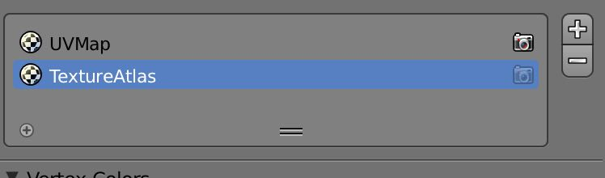

## Bake Blender Materials into a single Texture

This work describes how to bake the textures of different Blender assets into one large single texture image to 
take advantage of Unity's Render Batching.

The process should be repeatable during the iterations, so we keep the original Blender objects and textures around 
for refinements.

For this technique to work the .blend file must be created with these rules in mind:

* all objects into 1 .blend file
* unwrap each geometry in UVSlot 1
* paint or texture each object
* each object has 1 active material

This technique uses UV Channel 1 and 2 in the UV Slots of your geometry for diffuse color textures only, removing
lightmaps. You can use more UV channels but must be sure that the Texture Packer UV channel is either 1 or 2 
for Unity to see it.

1. Activate Texture Packer Plugin in Blender

    Texture packer is part of the standard Blender Add-Ons, and can be activated with 1 click from the Add-On 
    preferences.

    Documentation can be found here: https://wiki.blender.org/index.php/Extensions:2.6/Py/Scripts/UV/TextureAtlas

### Baking

1. Goto render settings
2. Under Texture Atlas Tab, create a Texture Atlas and add all objects for that atlas
3. Auto unwrap (this will go to UV channel 2)
4. Select each object and adjust the UVSettings like in the image (click the camera to be on Channel 1)

This tells Blender to use Channel 1 for input (the camera) and channel two for output (the selected one) for the bake.
    
    *TODO add script here*

5. Set Bake Mode: Texture
6. select all objects
7. Select TextureAtlas-Texture in UV editor as active texture
8. press “Bake” buttons 

9. Save Image 

### Unity

1. "Swap UVs" in Unity Import settings (to use TextureAtlas Channel 2 as Diffuse )
2. Actiate Generate Lightmap UV (Lightmap Uvs get generated in the Channel 1)

