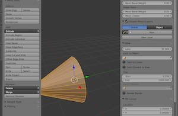
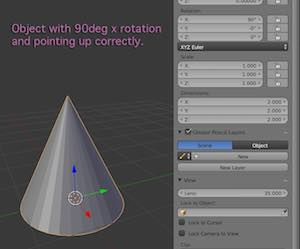
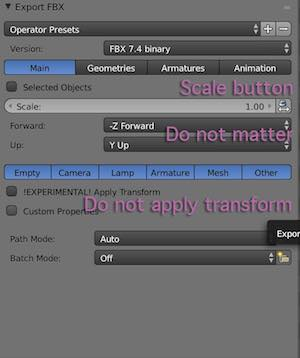

#Correctly export a model with proper orientation

1. Create the model. Apply rotation and scale. A good place for the pivot is at the origin. 
Unity subtracts -90deg from the x axis rotation. To make it 0 in Unity, first rotate the model by 90deg X.

3. To fix the rotation, enter edit mode and rotate all vertices -90deg on X to make up point up again. 

4. Export the model to FBX, do NOT apply transforms (and uncheck the scale button)


4. In Unity, the object will point up and forward correctly without any rotation applied. 
